# 信用贷款违约预测

## 1. 项目介绍
### 1.1. 项目背景
比赛由 Kaggle 举办，要求选手依据客户的信用卡信息，分期付款信息，信用局信息等为 Home Credit 预测客户贷款是否会违约。比赛原始地址为：https://www.kaggle.com/c/home-credit-default-risk?rvi=1 。在 Home Credit 提供的数据集及其关系如下图。

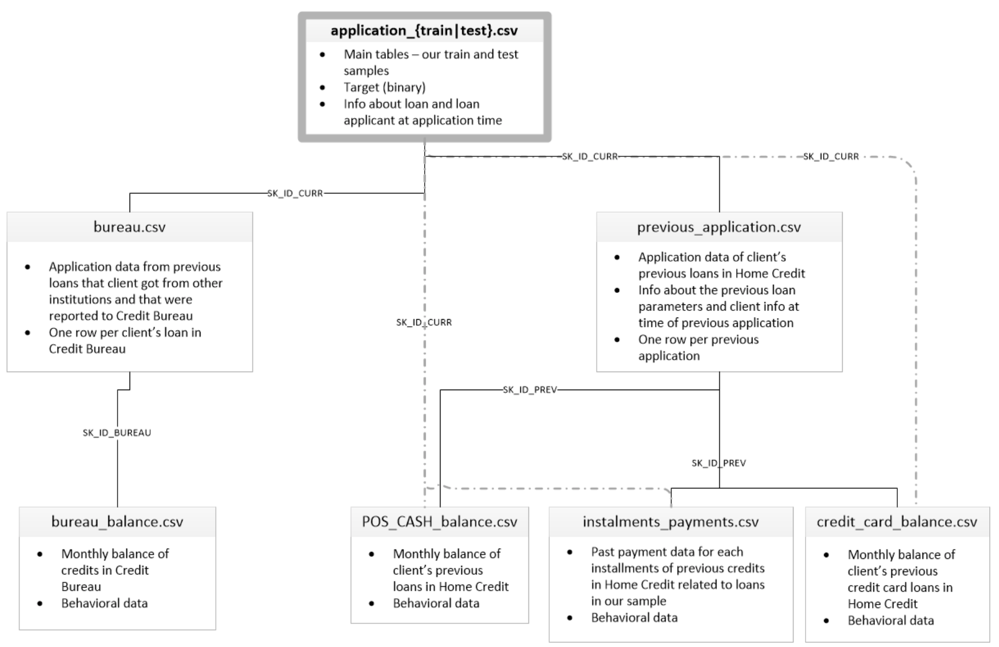
<center>图1.1 数据关系表</center>

其中，
* 主训练集和测试集（application_{train|test}.csv）：
    * 主要的数据集，分为训练组（包含货款违约情况）和测试组（不包含货款违约情况）；
    * 每行代表数据集中的一笔贷款资料。
* 信用局记录（bureau.csv）：
    * 信用局记录中，客户在其他金融机构的货款信息；
    * 每行代表一笔货款，申请日期为客户申请货款前。
* 过往货款记录（previous_application.csv）：
    * 电脑记录中，客户之前的货款信息；
    * 每行代表一笔客户之前的货款。

各表中的变量的含义，都被记录在参考文件 HomeCredit_columns_description.csv 中。

### 1.2. 项目流程
整个项目一共分为6个部分：
* 2. **数据清洗**：我们先对数据进行清洗，处理数据集中的异常值、缺失值。
* 3. **数据可视化**：利用图表，对违约用户和非违约用户的特征分布进行探索，总结违约用户的画像的基本的概念。
* 4. **特征工程**：根据用户个人信息特征和行为特征，构建特征工程。
* 5. **基础建模构建**：构建LightGBM模型进行建模预测。
* 6. **建模改良**：改良特征工程，构建新的LightGBM模型进行建模预测。

开始项目前，先导入必要的模块。


```python
""" Import necessary module """

import pandas as pd
import numpy as np
import matplotlib.pyplot as plt
import seaborn as sns
plt.style.use('ggplot')
sns.set_palette('RdBu')
```

## 2. 数据清洗
我们先导入数据集，并初步探索数据情况。


```python
""" Load Dataset """

app_train_dat = pd.read_csv('application_train.csv')
app_test_dat = pd.read_csv('application_test.csv')
bureau_dat = pd.read_csv('bureau.csv')
app_pre_dat = pd.read_csv('previous_application.csv')
```


```python
# Inspect data
app_train_dat.info()
app_train_dat.shape
```

    <class 'pandas.core.frame.DataFrame'>
    RangeIndex: 307511 entries, 0 to 307510
    Columns: 122 entries, SK_ID_CURR to AMT_REQ_CREDIT_BUREAU_YEAR
    dtypes: float64(65), int64(41), object(16)
    memory usage: 286.2+ MB


    (307511, 122)


```python
app_test_dat.info()
app_test_dat.shape
```

    <class 'pandas.core.frame.DataFrame'>
    RangeIndex: 48744 entries, 0 to 48743
    Columns: 121 entries, SK_ID_CURR to AMT_REQ_CREDIT_BUREAU_YEAR
    dtypes: float64(65), int64(40), object(16)
    memory usage: 45.0+ MB


    (48744, 121)


```python
app_train_dat.columns
```


    Index(['SK_ID_CURR', 'TARGET', 'NAME_CONTRACT_TYPE', 'CODE_GENDER',
           'FLAG_OWN_CAR', 'FLAG_OWN_REALTY', 'CNT_CHILDREN', 'AMT_INCOME_TOTAL',
           'AMT_CREDIT', 'AMT_ANNUITY',
           ...
           'FLAG_DOCUMENT_18', 'FLAG_DOCUMENT_19', 'FLAG_DOCUMENT_20',
           'FLAG_DOCUMENT_21', 'AMT_REQ_CREDIT_BUREAU_HOUR',
           'AMT_REQ_CREDIT_BUREAU_DAY', 'AMT_REQ_CREDIT_BUREAU_WEEK',
           'AMT_REQ_CREDIT_BUREAU_MON', 'AMT_REQ_CREDIT_BUREAU_QRT',
           'AMT_REQ_CREDIT_BUREAU_YEAR'],
          dtype='object', length=122)


```python
app_test_dat.columns
```


    Index(['SK_ID_CURR', 'NAME_CONTRACT_TYPE', 'CODE_GENDER', 'FLAG_OWN_CAR',
           'FLAG_OWN_REALTY', 'CNT_CHILDREN', 'AMT_INCOME_TOTAL', 'AMT_CREDIT',
           'AMT_ANNUITY', 'AMT_GOODS_PRICE',
           ...
           'FLAG_DOCUMENT_18', 'FLAG_DOCUMENT_19', 'FLAG_DOCUMENT_20',
           'FLAG_DOCUMENT_21', 'AMT_REQ_CREDIT_BUREAU_HOUR',
           'AMT_REQ_CREDIT_BUREAU_DAY', 'AMT_REQ_CREDIT_BUREAU_WEEK',
           'AMT_REQ_CREDIT_BUREAU_MON', 'AMT_REQ_CREDIT_BUREAU_QRT',
           'AMT_REQ_CREDIT_BUREAU_YEAR'],
          dtype='object', length=121)


```python
app_train_dat.head()
```


<div>
<style scoped>
    .dataframe tbody tr th:only-of-type {
        vertical-align: middle;
    }

    .dataframe tbody tr th {
        vertical-align: top;
    }

    .dataframe thead th {
        text-align: right;
    }
</style>
<table border="1" class="dataframe">
  <thead>
    <tr style="text-align: right;">
      <th></th>
      <th>SK_ID_CURR</th>
      <th>TARGET</th>
      <th>NAME_CONTRACT_TYPE</th>
      <th>CODE_GENDER</th>
      <th>FLAG_OWN_CAR</th>
      <th>FLAG_OWN_REALTY</th>
      <th>CNT_CHILDREN</th>
      <th>AMT_INCOME_TOTAL</th>
      <th>AMT_CREDIT</th>
      <th>AMT_ANNUITY</th>
      <th>...</th>
      <th>FLAG_DOCUMENT_18</th>
      <th>FLAG_DOCUMENT_19</th>
      <th>FLAG_DOCUMENT_20</th>
      <th>FLAG_DOCUMENT_21</th>
      <th>AMT_REQ_CREDIT_BUREAU_HOUR</th>
      <th>AMT_REQ_CREDIT_BUREAU_DAY</th>
      <th>AMT_REQ_CREDIT_BUREAU_WEEK</th>
      <th>AMT_REQ_CREDIT_BUREAU_MON</th>
      <th>AMT_REQ_CREDIT_BUREAU_QRT</th>
      <th>AMT_REQ_CREDIT_BUREAU_YEAR</th>
    </tr>
  </thead>
  <tbody>
    <tr>
      <th>0</th>
      <td>100002</td>
      <td>1</td>
      <td>Cash loans</td>
      <td>M</td>
      <td>N</td>
      <td>Y</td>
      <td>0</td>
      <td>202500.0</td>
      <td>406597.5</td>
      <td>24700.5</td>
      <td>...</td>
      <td>0</td>
      <td>0</td>
      <td>0</td>
      <td>0</td>
      <td>0.0</td>
      <td>0.0</td>
      <td>0.0</td>
      <td>0.0</td>
      <td>0.0</td>
      <td>1.0</td>
    </tr>
    <tr>
      <th>1</th>
      <td>100003</td>
      <td>0</td>
      <td>Cash loans</td>
      <td>F</td>
      <td>N</td>
      <td>N</td>
      <td>0</td>
      <td>270000.0</td>
      <td>1293502.5</td>
      <td>35698.5</td>
      <td>...</td>
      <td>0</td>
      <td>0</td>
      <td>0</td>
      <td>0</td>
      <td>0.0</td>
      <td>0.0</td>
      <td>0.0</td>
      <td>0.0</td>
      <td>0.0</td>
      <td>0.0</td>
    </tr>
    <tr>
      <th>2</th>
      <td>100004</td>
      <td>0</td>
      <td>Revolving loans</td>
      <td>M</td>
      <td>Y</td>
      <td>Y</td>
      <td>0</td>
      <td>67500.0</td>
      <td>135000.0</td>
      <td>6750.0</td>
      <td>...</td>
      <td>0</td>
      <td>0</td>
      <td>0</td>
      <td>0</td>
      <td>0.0</td>
      <td>0.0</td>
      <td>0.0</td>
      <td>0.0</td>
      <td>0.0</td>
      <td>0.0</td>
    </tr>
    <tr>
      <th>3</th>
      <td>100006</td>
      <td>0</td>
      <td>Cash loans</td>
      <td>F</td>
      <td>N</td>
      <td>Y</td>
      <td>0</td>
      <td>135000.0</td>
      <td>312682.5</td>
      <td>29686.5</td>
      <td>...</td>
      <td>0</td>
      <td>0</td>
      <td>0</td>
      <td>0</td>
      <td>NaN</td>
      <td>NaN</td>
      <td>NaN</td>
      <td>NaN</td>
      <td>NaN</td>
      <td>NaN</td>
    </tr>
    <tr>
      <th>4</th>
      <td>100007</td>
      <td>0</td>
      <td>Cash loans</td>
      <td>M</td>
      <td>N</td>
      <td>Y</td>
      <td>0</td>
      <td>121500.0</td>
      <td>513000.0</td>
      <td>21865.5</td>
      <td>...</td>
      <td>0</td>
      <td>0</td>
      <td>0</td>
      <td>0</td>
      <td>0.0</td>
      <td>0.0</td>
      <td>0.0</td>
      <td>0.0</td>
      <td>0.0</td>
      <td>0.0</td>
    </tr>
  </tbody>
</table>
<p>5 rows × 122 columns</p>
</div>


```python
app_test_dat.head()
```


<div>
<style scoped>
    .dataframe tbody tr th:only-of-type {
        vertical-align: middle;
    }

    .dataframe tbody tr th {
        vertical-align: top;
    }

    .dataframe thead th {
        text-align: right;
    }
</style>
<table border="1" class="dataframe">
  <thead>
    <tr style="text-align: right;">
      <th></th>
      <th>SK_ID_CURR</th>
      <th>NAME_CONTRACT_TYPE</th>
      <th>CODE_GENDER</th>
      <th>FLAG_OWN_CAR</th>
      <th>FLAG_OWN_REALTY</th>
      <th>CNT_CHILDREN</th>
      <th>AMT_INCOME_TOTAL</th>
      <th>AMT_CREDIT</th>
      <th>AMT_ANNUITY</th>
      <th>AMT_GOODS_PRICE</th>
      <th>...</th>
      <th>FLAG_DOCUMENT_18</th>
      <th>FLAG_DOCUMENT_19</th>
      <th>FLAG_DOCUMENT_20</th>
      <th>FLAG_DOCUMENT_21</th>
      <th>AMT_REQ_CREDIT_BUREAU_HOUR</th>
      <th>AMT_REQ_CREDIT_BUREAU_DAY</th>
      <th>AMT_REQ_CREDIT_BUREAU_WEEK</th>
      <th>AMT_REQ_CREDIT_BUREAU_MON</th>
      <th>AMT_REQ_CREDIT_BUREAU_QRT</th>
      <th>AMT_REQ_CREDIT_BUREAU_YEAR</th>
    </tr>
  </thead>
  <tbody>
    <tr>
      <th>0</th>
      <td>100001</td>
      <td>Cash loans</td>
      <td>F</td>
      <td>N</td>
      <td>Y</td>
      <td>0</td>
      <td>135000.0</td>
      <td>568800.0</td>
      <td>20560.5</td>
      <td>450000.0</td>
      <td>...</td>
      <td>0</td>
      <td>0</td>
      <td>0</td>
      <td>0</td>
      <td>0.0</td>
      <td>0.0</td>
      <td>0.0</td>
      <td>0.0</td>
      <td>0.0</td>
      <td>0.0</td>
    </tr>
    <tr>
      <th>1</th>
      <td>100005</td>
      <td>Cash loans</td>
      <td>M</td>
      <td>N</td>
      <td>Y</td>
      <td>0</td>
      <td>99000.0</td>
      <td>222768.0</td>
      <td>17370.0</td>
      <td>180000.0</td>
      <td>...</td>
      <td>0</td>
      <td>0</td>
      <td>0</td>
      <td>0</td>
      <td>0.0</td>
      <td>0.0</td>
      <td>0.0</td>
      <td>0.0</td>
      <td>0.0</td>
      <td>3.0</td>
    </tr>
    <tr>
      <th>2</th>
      <td>100013</td>
      <td>Cash loans</td>
      <td>M</td>
      <td>Y</td>
      <td>Y</td>
      <td>0</td>
      <td>202500.0</td>
      <td>663264.0</td>
      <td>69777.0</td>
      <td>630000.0</td>
      <td>...</td>
      <td>0</td>
      <td>0</td>
      <td>0</td>
      <td>0</td>
      <td>0.0</td>
      <td>0.0</td>
      <td>0.0</td>
      <td>0.0</td>
      <td>1.0</td>
      <td>4.0</td>
    </tr>
    <tr>
      <th>3</th>
      <td>100028</td>
      <td>Cash loans</td>
      <td>F</td>
      <td>N</td>
      <td>Y</td>
      <td>2</td>
      <td>315000.0</td>
      <td>1575000.0</td>
      <td>49018.5</td>
      <td>1575000.0</td>
      <td>...</td>
      <td>0</td>
      <td>0</td>
      <td>0</td>
      <td>0</td>
      <td>0.0</td>
      <td>0.0</td>
      <td>0.0</td>
      <td>0.0</td>
      <td>0.0</td>
      <td>3.0</td>
    </tr>
    <tr>
      <th>4</th>
      <td>100038</td>
      <td>Cash loans</td>
      <td>M</td>
      <td>Y</td>
      <td>N</td>
      <td>1</td>
      <td>180000.0</td>
      <td>625500.0</td>
      <td>32067.0</td>
      <td>625500.0</td>
      <td>...</td>
      <td>0</td>
      <td>0</td>
      <td>0</td>
      <td>0</td>
      <td>NaN</td>
      <td>NaN</td>
      <td>NaN</td>
      <td>NaN</td>
      <td>NaN</td>
      <td>NaN</td>
    </tr>
  </tbody>
</table>
<p>5 rows × 121 columns</p>
</div>


从上面的结果我们可以得出，主训练集（Application_train）和 测试集（application_test）都有121个变量，包括唯一主键`'SK_ID_CURR'`和其他特征变量。同时，训练集中有307511条记录，测试集有48744条记录。但是变量`'TARGET'`为客户违约情况，只记录在主训练集中。


```python
# Bureau information
bureau_dat.info()
```

    <class 'pandas.core.frame.DataFrame'>
    RangeIndex: 1716428 entries, 0 to 1716427
    Data columns (total 17 columns):
     #   Column                  Dtype  
    ---  ------                  -----  
     0   SK_ID_CURR              int64  
     1   SK_ID_BUREAU            int64  
     2   CREDIT_ACTIVE           object 
     3   CREDIT_CURRENCY         object 
     4   DAYS_CREDIT             int64  
     5   CREDIT_DAY_OVERDUE      int64  
     6   DAYS_CREDIT_ENDDATE     float64
     7   DAYS_ENDDATE_FACT       float64
     8   AMT_CREDIT_MAX_OVERDUE  float64
     9   CNT_CREDIT_PROLONG      int64  
     10  AMT_CREDIT_SUM          float64
     11  AMT_CREDIT_SUM_DEBT     float64
     12  AMT_CREDIT_SUM_LIMIT    float64
     13  AMT_CREDIT_SUM_OVERDUE  float64
     14  CREDIT_TYPE             object 
     15  DAYS_CREDIT_UPDATE      int64  
     16  AMT_ANNUITY             float64
    dtypes: float64(8), int64(6), object(3)
    memory usage: 222.6+ MB


```python
# previous application information
app_pre_dat.info()
```

    <class 'pandas.core.frame.DataFrame'>
    RangeIndex: 1670214 entries, 0 to 1670213
    Data columns (total 37 columns):
     #   Column                       Non-Null Count    Dtype  
    ---  ------                       --------------    -----  
     0   SK_ID_PREV                   1670214 non-null  int64  
     1   SK_ID_CURR                   1670214 non-null  int64  
     2   NAME_CONTRACT_TYPE           1670214 non-null  object 
     3   AMT_ANNUITY                  1297979 non-null  float64
     4   AMT_APPLICATION              1670214 non-null  float64
     5   AMT_CREDIT                   1670213 non-null  float64
     6   AMT_DOWN_PAYMENT             774370 non-null   float64
     7   AMT_GOODS_PRICE              1284699 non-null  float64
     8   WEEKDAY_APPR_PROCESS_START   1670214 non-null  object 
     9   HOUR_APPR_PROCESS_START      1670214 non-null  int64  
     10  FLAG_LAST_APPL_PER_CONTRACT  1670214 non-null  object 
     11  NFLAG_LAST_APPL_IN_DAY       1670214 non-null  int64  
     12  RATE_DOWN_PAYMENT            774370 non-null   float64
     13  RATE_INTEREST_PRIMARY        5951 non-null     float64
     14  RATE_INTEREST_PRIVILEGED     5951 non-null     float64
     15  NAME_CASH_LOAN_PURPOSE       1670214 non-null  object 
     16  NAME_CONTRACT_STATUS         1670214 non-null  object 
     17  DAYS_DECISION                1670214 non-null  int64  
     18  NAME_PAYMENT_TYPE            1670214 non-null  object 
     19  CODE_REJECT_REASON           1670214 non-null  object 
     20  NAME_TYPE_SUITE              849809 non-null   object 
     21  NAME_CLIENT_TYPE             1670214 non-null  object 
     22  NAME_GOODS_CATEGORY          1670214 non-null  object 
     23  NAME_PORTFOLIO               1670214 non-null  object 
     24  NAME_PRODUCT_TYPE            1670214 non-null  object 
     25  CHANNEL_TYPE                 1670214 non-null  object 
     26  SELLERPLACE_AREA             1670214 non-null  int64  
     27  NAME_SELLER_INDUSTRY         1670214 non-null  object 
     28  CNT_PAYMENT                  1297984 non-null  float64
     29  NAME_YIELD_GROUP             1670214 non-null  object 
     30  PRODUCT_COMBINATION          1669868 non-null  object 
     31  DAYS_FIRST_DRAWING           997149 non-null   float64
     32  DAYS_FIRST_DUE               997149 non-null   float64
     33  DAYS_LAST_DUE_1ST_VERSION    997149 non-null   float64
     34  DAYS_LAST_DUE                997149 non-null   float64
     35  DAYS_TERMINATION             997149 non-null   float64
     36  NFLAG_INSURED_ON_APPROVAL    997149 non-null   float64
    dtypes: float64(15), int64(6), object(16)
    memory usage: 471.5+ MB


另一方面，信用局记录（bureau.csv）和 过往货款记录（previous_application.csv）均有主键`SK_ID_CURR`，但是这两个数据集分别包含了1716428和1670214条记录，说明在主训练集和测试集中的客户可能存在多次货款的情况，这将要在构建特征工程时处理。

接下来是检查缺失值和异常值。下面的表中，主训练集数据一共有122列，有67列存在缺失情况，最高缺失值的列缺失度为69.9%。我们注意到，前面的几列特征缺失度的都是一样的，同时这种缺少情况也出现在测试集中。并且它们都是属于房屋信息，根据这个规律，可以猜测用户缺失房屋信息可能是因为某种特定原因导致的，而不是随机缺失，这点我们可以在后面的特征工程用上。

由于这次项目将利用LightGBM模型，其可以把 $0$ 看作为缺失值，并把缺少值作为模型分类时到一部分。因此，我们只需要把缺失值较高（缺失值大于80%）的列直接删除即可。这里没有这种类型的缺失值，因此我们无需处理缺失值。


```python
#%% 
""" Handle missing value in main dataset """

# Create a function to check the missing values
def missing_values_check(df):
    
    # Count the missing values by columns
    df_mis_val = pd.DataFrame(df.isnull().sum())
    
    df_mis = df_mis_val.rename(columns={0:'Missing Value count'})
    
    df_mis = df_mis[df_mis.iloc[:,0]!=0]
    
    # Calculate the precentage of values missing by columns
    df_mis['Missing rate of Total'] = df_mis.iloc[:,0] / len(df)
    
    # Print summary
    print ("There are " +str(df.shape[1]) +" columns in this dataset." +"\n"
           +str(df_mis.shape[0])
           +" columns have missing values."+"\n")
    
    # Sort the value by decrease and Print the values
    return df_mis.sort_values('Missing Value count', ascending=False)

missing_values_check(app_train_dat).head(20)
```

    There are 122 columns in this dataset.
    67 columns have missing values.
    


<div>
<style scoped>
    .dataframe tbody tr th:only-of-type {
        vertical-align: middle;
    }

    .dataframe tbody tr th {
        vertical-align: top;
    }

    .dataframe thead th {
        text-align: right;
    }
</style>
<table border="1" class="dataframe">
  <thead>
    <tr style="text-align: right;">
      <th></th>
      <th>Missing Value count</th>
      <th>Missing rate of Total</th>
    </tr>
  </thead>
  <tbody>
    <tr>
      <th>COMMONAREA_MEDI</th>
      <td>214865</td>
      <td>0.698723</td>
    </tr>
    <tr>
      <th>COMMONAREA_AVG</th>
      <td>214865</td>
      <td>0.698723</td>
    </tr>
    <tr>
      <th>COMMONAREA_MODE</th>
      <td>214865</td>
      <td>0.698723</td>
    </tr>
    <tr>
      <th>NONLIVINGAPARTMENTS_MEDI</th>
      <td>213514</td>
      <td>0.694330</td>
    </tr>
    <tr>
      <th>NONLIVINGAPARTMENTS_MODE</th>
      <td>213514</td>
      <td>0.694330</td>
    </tr>
    <tr>
      <th>NONLIVINGAPARTMENTS_AVG</th>
      <td>213514</td>
      <td>0.694330</td>
    </tr>
    <tr>
      <th>FONDKAPREMONT_MODE</th>
      <td>210295</td>
      <td>0.683862</td>
    </tr>
    <tr>
      <th>LIVINGAPARTMENTS_MODE</th>
      <td>210199</td>
      <td>0.683550</td>
    </tr>
    <tr>
      <th>LIVINGAPARTMENTS_MEDI</th>
      <td>210199</td>
      <td>0.683550</td>
    </tr>
    <tr>
      <th>LIVINGAPARTMENTS_AVG</th>
      <td>210199</td>
      <td>0.683550</td>
    </tr>
    <tr>
      <th>FLOORSMIN_MODE</th>
      <td>208642</td>
      <td>0.678486</td>
    </tr>
    <tr>
      <th>FLOORSMIN_MEDI</th>
      <td>208642</td>
      <td>0.678486</td>
    </tr>
    <tr>
      <th>FLOORSMIN_AVG</th>
      <td>208642</td>
      <td>0.678486</td>
    </tr>
    <tr>
      <th>YEARS_BUILD_MODE</th>
      <td>204488</td>
      <td>0.664978</td>
    </tr>
    <tr>
      <th>YEARS_BUILD_MEDI</th>
      <td>204488</td>
      <td>0.664978</td>
    </tr>
    <tr>
      <th>YEARS_BUILD_AVG</th>
      <td>204488</td>
      <td>0.664978</td>
    </tr>
    <tr>
      <th>OWN_CAR_AGE</th>
      <td>202929</td>
      <td>0.659908</td>
    </tr>
    <tr>
      <th>LANDAREA_AVG</th>
      <td>182590</td>
      <td>0.593767</td>
    </tr>
    <tr>
      <th>LANDAREA_MEDI</th>
      <td>182590</td>
      <td>0.593767</td>
    </tr>
    <tr>
      <th>LANDAREA_MODE</th>
      <td>182590</td>
      <td>0.593767</td>
    </tr>
  </tbody>
</table>
</div>


```python
missing_values_check(app_test_dat).head(20)
```

    There are 121 columns in this dataset.
    64 columns have missing values.
    


<div>
<style scoped>
    .dataframe tbody tr th:only-of-type {
        vertical-align: middle;
    }

    .dataframe tbody tr th {
        vertical-align: top;
    }

    .dataframe thead th {
        text-align: right;
    }
</style>
<table border="1" class="dataframe">
  <thead>
    <tr style="text-align: right;">
      <th></th>
      <th>Missing Value count</th>
      <th>Missing rate of Total</th>
    </tr>
  </thead>
  <tbody>
    <tr>
      <th>COMMONAREA_MODE</th>
      <td>33495</td>
      <td>0.687161</td>
    </tr>
    <tr>
      <th>COMMONAREA_MEDI</th>
      <td>33495</td>
      <td>0.687161</td>
    </tr>
    <tr>
      <th>COMMONAREA_AVG</th>
      <td>33495</td>
      <td>0.687161</td>
    </tr>
    <tr>
      <th>NONLIVINGAPARTMENTS_MEDI</th>
      <td>33347</td>
      <td>0.684125</td>
    </tr>
    <tr>
      <th>NONLIVINGAPARTMENTS_AVG</th>
      <td>33347</td>
      <td>0.684125</td>
    </tr>
    <tr>
      <th>NONLIVINGAPARTMENTS_MODE</th>
      <td>33347</td>
      <td>0.684125</td>
    </tr>
    <tr>
      <th>FONDKAPREMONT_MODE</th>
      <td>32797</td>
      <td>0.672842</td>
    </tr>
    <tr>
      <th>LIVINGAPARTMENTS_MODE</th>
      <td>32780</td>
      <td>0.672493</td>
    </tr>
    <tr>
      <th>LIVINGAPARTMENTS_MEDI</th>
      <td>32780</td>
      <td>0.672493</td>
    </tr>
    <tr>
      <th>LIVINGAPARTMENTS_AVG</th>
      <td>32780</td>
      <td>0.672493</td>
    </tr>
    <tr>
      <th>FLOORSMIN_MEDI</th>
      <td>32466</td>
      <td>0.666051</td>
    </tr>
    <tr>
      <th>FLOORSMIN_MODE</th>
      <td>32466</td>
      <td>0.666051</td>
    </tr>
    <tr>
      <th>FLOORSMIN_AVG</th>
      <td>32466</td>
      <td>0.666051</td>
    </tr>
    <tr>
      <th>OWN_CAR_AGE</th>
      <td>32312</td>
      <td>0.662892</td>
    </tr>
    <tr>
      <th>YEARS_BUILD_AVG</th>
      <td>31818</td>
      <td>0.652757</td>
    </tr>
    <tr>
      <th>YEARS_BUILD_MEDI</th>
      <td>31818</td>
      <td>0.652757</td>
    </tr>
    <tr>
      <th>YEARS_BUILD_MODE</th>
      <td>31818</td>
      <td>0.652757</td>
    </tr>
    <tr>
      <th>LANDAREA_MODE</th>
      <td>28254</td>
      <td>0.579641</td>
    </tr>
    <tr>
      <th>LANDAREA_AVG</th>
      <td>28254</td>
      <td>0.579641</td>
    </tr>
    <tr>
      <th>LANDAREA_MEDI</th>
      <td>28254</td>
      <td>0.579641</td>
    </tr>
  </tbody>
</table>
</div>


# 3.数据可视化

这部分分析的目标主要是查看违约用户和非违约用户的特征分布情况，目标是对违约用户的画像建立一个基本的了解，为后续特征工程打下基础。用户画像主要个人信息特征和行为特征两个方面。这部分主要为个人信息特征，包括性别、年龄等等。可以得出如以下问题：
* 男性更容易违约，还是女性？
* 年龄大的人更容易违约，还是年龄小的人？

其中，个人信息特征主要可分为：
* 货款类型
* 基本个人信息
* 职业信息
* 物业信息


```python
""" Data Exploration """

# Create a function to plot the distribut of the feature
def explore_object(df, var_name,horizontal_layout=True,label_rotation=False):
    
    temp = df[var_name].value_counts()
    df_count = pd.DataFrame({var_name: temp.index,'Number of contracts': temp.values})

    # Calculate the percentage of target=1 per category value
    cat_perc = df[[var_name, 'TARGET']].groupby([var_name],as_index=False).mean()
    cat_perc.sort_values(by='TARGET', ascending=False, inplace=True)
    
    if(horizontal_layout):
        fig, (ax1, ax2) = plt.subplots(ncols=2, figsize=(12,6))
    else:
        fig, (ax1, ax2) = plt.subplots(nrows=2, figsize=(12,14))
    
    # Plot figure: Number of contracts
    sns.set_color_codes('pastel')
    _ = sns.barplot(x=var_name, y='Number of contracts', data=df_count, ax=ax1)
    if(label_rotation):
        _.set_xticklabels(_.get_xticklabels(),rotation=90)
    
    # Plot figure: Percent of default
    _ = sns.barplot(x=var_name, y='TARGET', order=cat_perc[var_name], data=cat_perc, ax=ax2)
    if(label_rotation):
        _.set_xticklabels(_.get_xticklabels(),rotation=90)
    
    plt.ylabel('Percent of client with default [%]', fontsize=10)
    plt.tick_params(axis='both', which='major', labelsize=10)

    plt.show()
    
    print('Number of contracts')
    print(df_count)
    print('\n')
    print('Percent of client with default [%]')
    print(cat_perc)
    print('\n')

# Create a function to explore the feature with explore_figure
def explore_numeric(df, var_name, date_transfer=False):
    
    # Calculate the correlation coefficient between the new variable and the target
    corr = df['TARGET'].corr(df[var_name])
    
    # Calculate repaid vs not repaid
    repaid = df.loc[df['TARGET'] == 0, var_name]
    not_repaid = df.loc[df['TARGET'] == 1, var_name]
    
    if (date_transfer):
        repaid = repaid / -365
        not_repaid = not_repaid / -365

    plt.figure(figsize = (12, 6))
    
    # Plot the distribution for target == 0 and target == 1
    sns.kdeplot(repaid, label = 'TARGET == 0', alpha = 0.8)
    sns.kdeplot(not_repaid, label = 'TARGET == 1', alpha=0.8)
    
    # label the plot
    plt.xlabel(var_name)
    plt.ylabel('Density')
    plt.title('%s Distribution' % var_name)
    plt.legend()
    
    plt.show()
    
    # print out the correlation
    print('The correlation between %s and the TARGET is %0.4f' % (var_name, corr))
    # Print out average values
    print('Median value for loan that was not repaid = %0.4f' % not_repaid.median())
    print('Median value for loan that was repaid =     %0.4f' % repaid.median())
```

**货款类型**

首先查看货款类型的违约率情况，发现现金货款的用户的违约率更高，现金货款的违约率约为8%，循环贷款的违约率约为5%。


```python
## Type of loan
# Exploration analysis with Type of loan
explore_object(app_train_dat, 'NAME_CONTRACT_TYPE')
```


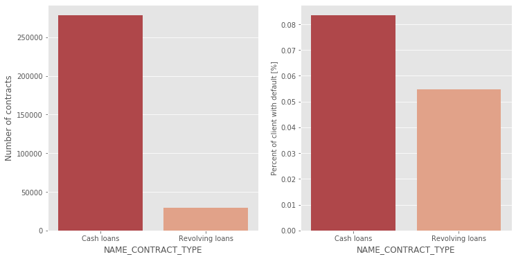


    Number of contracts
      NAME_CONTRACT_TYPE  Number of contracts
    0         Cash loans               278232
    1    Revolving loans                29279
    
    
    Percent of client with default [%]
      NAME_CONTRACT_TYPE    TARGET
    0         Cash loans  0.083459
    1    Revolving loans  0.054783
    
    


**基本个人信息**

下面查看基本个人信息的违约率情况，显示违约用户的性别分布情况。发现男性的用户的违约率更高，男性用户的违约率约为10%，女性约为7%。


```python
## Client's Basic information
# Exploration analysis with Gender
explore_object(app_train_dat, 'CODE_GENDER')
```


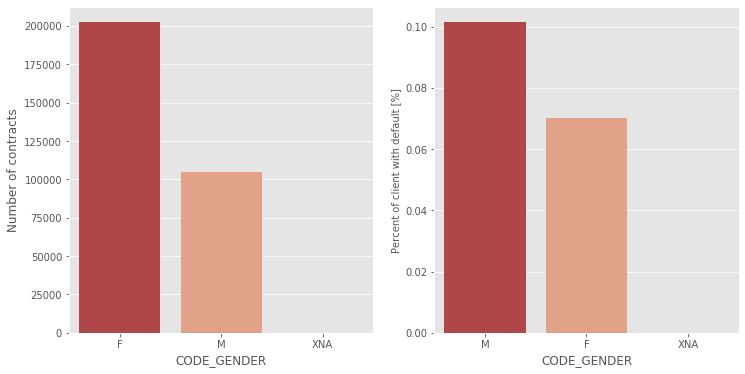


    Number of contracts
      CODE_GENDER  Number of contracts
    0           F               202448
    1           M               105059
    2         XNA                    4
    
    
    Percent of client with default [%]
      CODE_GENDER    TARGET
    1           M  0.101419
    0           F  0.069993
    2         XNA  0.000000
    
    


然后查看违约用户的年龄分布情况，通过数据分布我们可以看到，违约用户年轻用户分布更多，所以我们可以推断的结论是用户年龄越小，违约的可能性越大。


```python
#  Exploration analysis with Client's age
explore_numeric(app_train_dat, 'DAYS_BIRTH', date_transfer=True)
```


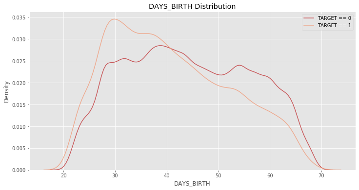


    The correlation between DAYS_BIRTH and the TARGET is 0.0782
    Median value for loan that was not repaid = 39.1288
    Median value for loan that was repaid =     43.4986


下面查看违约用户的学历分布情况。发现低学历用户的违约率比高学历用户要高。


```python
#  Exploration analysis with Client's education level
explore_object(app_train_dat, 'NAME_EDUCATION_TYPE')
```


    Number of contracts
                 NAME_EDUCATION_TYPE  Number of contracts
    0  Secondary / secondary special               218391
    1               Higher education                74863
    2              Incomplete higher                10277
    3                Lower secondary                 3816
    4                Academic degree                  164
    
    
    Percent of client with default [%]
                 NAME_EDUCATION_TYPE    TARGET
    3                Lower secondary  0.109277
    4  Secondary / secondary special  0.089399
    2              Incomplete higher  0.084850
    1               Higher education  0.053551
    0                Academic degree  0.018293
    
    


下面查看违约用户的婚姻状况。发现低学历用户的违约率比高学历用户要高。


```python
# Exploration analysis with Family Status
explore_object(app_train_dat, 'NAME_FAMILY_STATUS', label_rotation=True)
```


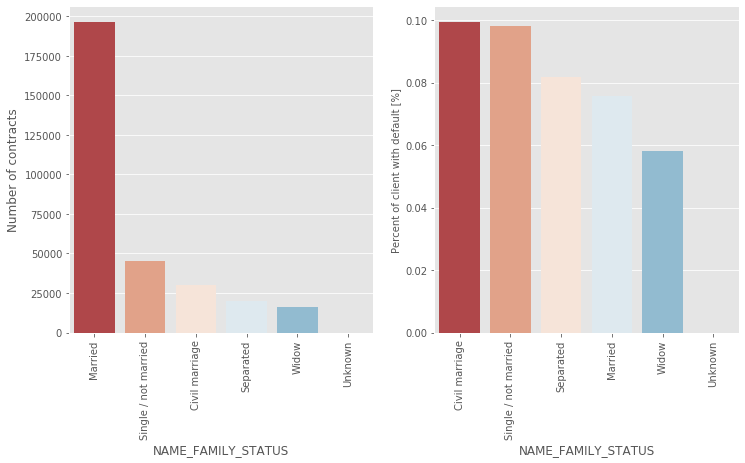


    Number of contracts
         NAME_FAMILY_STATUS  Number of contracts
    0               Married               196432
    1  Single / not married                45444
    2        Civil marriage                29775
    3             Separated                19770
    4                 Widow                16088
    5               Unknown                    2
    
    
    Percent of client with default [%]
         NAME_FAMILY_STATUS    TARGET
    0        Civil marriage  0.099446
    3  Single / not married  0.098077
    2             Separated  0.081942
    1               Married  0.075599
    5                 Widow  0.058242
    4               Unknown  0.000000
    
    


对于子女信息，大部分申请者没有孩子或孩子在3个以下，孩子越多的家庭违约率越高，发现对于有9、11个孩子的家庭违约率达到了100%，猜测和样本少的原因。


```python
# Exploration analysis with Children number
explore_object(app_train_dat, 'CNT_CHILDREN')
```


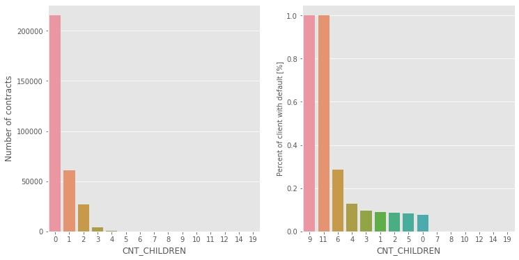


    Number of contracts
        CNT_CHILDREN  Number of contracts
    0              0               215371
    1              1                61119
    2              2                26749
    3              3                 3717
    4              4                  429
    5              5                   84
    6              6                   21
    7              7                    7
    8             14                    3
    9             19                    2
    10            12                    2
    11            10                    2
    12             9                    2
    13             8                    2
    14            11                    1
    
    
    Percent of client with default [%]
        CNT_CHILDREN    TARGET
    9              9  1.000000
    11            11  1.000000
    6              6  0.285714
    4              4  0.128205
    3              3  0.096314
    1              1  0.089236
    2              2  0.087218
    5              5  0.083333
    0              0  0.077118
    7              7  0.000000
    8              8  0.000000
    10            10  0.000000
    12            12  0.000000
    13            14  0.000000
    14            19  0.000000
    
    


**职业信息**

接下来是申请者的职业信息，先是违约用户的工作年限。我们发现原始数据中出现 $-1000$，但是年工作的年限不可能为负数。于是，我们对异常值进行处理后，再次画出图像。发现违约用户主要分布在年轻用户中，所以我们可以推断的结论是用户工作年限越小，违约的可能性越大。


```python
## Job information
#  Exploration analysis with Client's working years
explore_numeric(app_train_dat, 'DAYS_EMPLOYED', date_transfer=True)

app_train_dat['DAYS_EMPLOYED'].replace({365243: np.nan}, inplace = True)
explore_numeric(app_train_dat, 'DAYS_EMPLOYED', date_transfer=True)
```


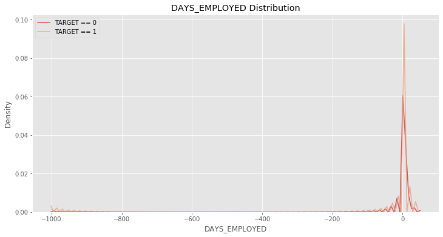


    The correlation between DAYS_EMPLOYED and the TARGET is -0.0449
    Median value for loan that was not repaid = 2.8329
    Median value for loan that was repaid =     3.3836


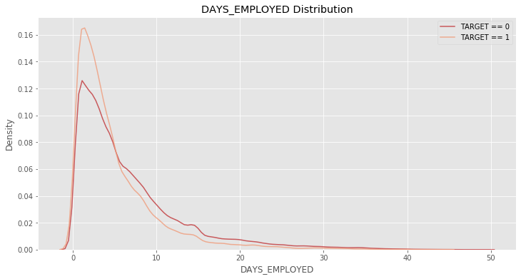


    The correlation between DAYS_EMPLOYED and the TARGET is 0.0750
    Median value for loan that was not repaid = 3.3699
    Median value for loan that was repaid =     4.6329


然后是申请者的收入来源情况，从图中可以看出大部分申请者都是以工作收入为主。而在各个收入来源中，孕妇和无工作者违约率较高，在35%以上，对于这两类人群放款需较为谨慎。


```python
# Exploration analysis with Income type
explore_object(app_train_dat, 'NAME_INCOME_TYPE',horizontal_layout=False)
```


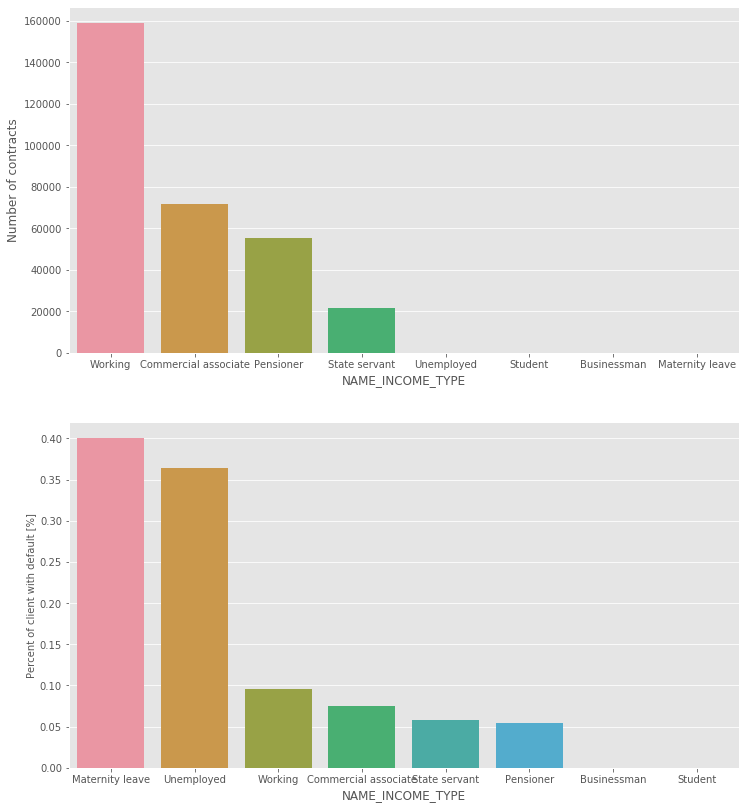


    Number of contracts
           NAME_INCOME_TYPE  Number of contracts
    0               Working               158774
    1  Commercial associate                71617
    2             Pensioner                55362
    3         State servant                21703
    4            Unemployed                   22
    5               Student                   18
    6           Businessman                   10
    7       Maternity leave                    5
    
    
    Percent of client with default [%]
           NAME_INCOME_TYPE    TARGET
    2       Maternity leave  0.400000
    6            Unemployed  0.363636
    7               Working  0.095885
    1  Commercial associate  0.074843
    4         State servant  0.057550
    3             Pensioner  0.053864
    0           Businessman  0.000000
    5               Student  0.000000
    
    


从职业来看，越相对收入较低、不稳定的职业违约率越高，比如低廉劳动力、司机、理发师，而像会计、高科技员工等具有稳定高收入的职业违约率就较低。


```python
# Exploration analysis with Job type
explore_object(app_train_dat, 'OCCUPATION_TYPE', label_rotation=True, horizontal_layout=False)
```


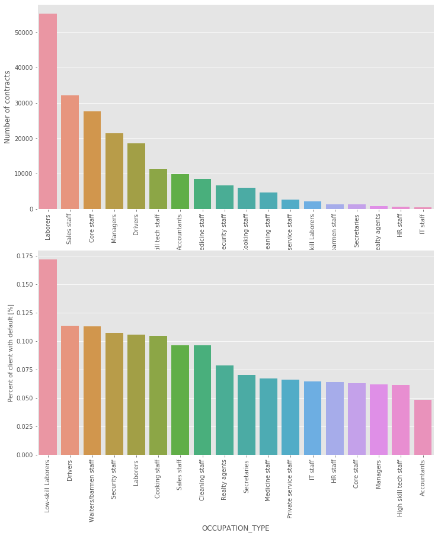


    Number of contracts
              OCCUPATION_TYPE  Number of contracts
    0                Laborers                55186
    1             Sales staff                32102
    2              Core staff                27570
    3                Managers                21371
    4                 Drivers                18603
    5   High skill tech staff                11380
    6             Accountants                 9813
    7          Medicine staff                 8537
    8          Security staff                 6721
    9           Cooking staff                 5946
    10         Cleaning staff                 4653
    11  Private service staff                 2652
    12     Low-skill Laborers                 2093
    13   Waiters/barmen staff                 1348
    14            Secretaries                 1305
    15          Realty agents                  751
    16               HR staff                  563
    17               IT staff                  526
    
    
    Percent of client with default [%]
              OCCUPATION_TYPE    TARGET
    9      Low-skill Laborers  0.171524
    4                 Drivers  0.113261
    17   Waiters/barmen staff  0.112760
    16         Security staff  0.107424
    8                Laborers  0.105788
    2           Cooking staff  0.104440
    14            Sales staff  0.096318
    1          Cleaning staff  0.096067
    13          Realty agents  0.078562
    15            Secretaries  0.070498
    11         Medicine staff  0.067002
    12  Private service staff  0.065988
    7                IT staff  0.064639
    5                HR staff  0.063943
    3              Core staff  0.063040
    10               Managers  0.062140
    6   High skill tech staff  0.061599
    0             Accountants  0.048303
    
    


**物业信息**

最后是申请者的物业信息，查看用户有没有房和车对违约率的影响，发现没有车和房的人违约率更高，但相差均不大。


```python
## Property information
# Exploration analysis with Car
explore_object(app_train_dat, 'FLAG_OWN_CAR')
```


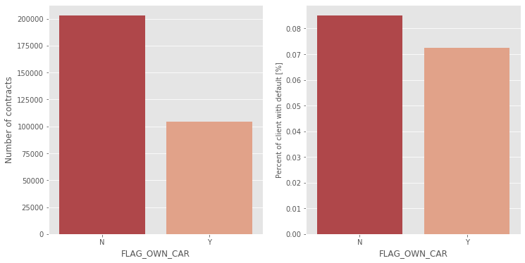


    Number of contracts
      FLAG_OWN_CAR  Number of contracts
    0            N               202924
    1            Y               104587
    
    
    Percent of client with default [%]
      FLAG_OWN_CAR    TARGET
    0            N  0.085002
    1            Y  0.072437
    
    


```python
# Exploration analysis with Flat
explore_object(app_train_dat, 'FLAG_OWN_REALTY')
```


    Number of contracts
      FLAG_OWN_REALTY  Number of contracts
    0               Y               213312
    1               N                94199
    
    
    Percent of client with default [%]
      FLAG_OWN_REALTY    TARGET
    0               N  0.083249
    1               Y  0.079616
    
    


# 3. 特征工程

基于对客户行为特征的理解，构建以下新特征。
1. `'INCOME_PER_CHILD'`：
    * 客户收入/孩子数量；
    * 客户的收入平均到每个孩子身上，同样的收入，如果这个人的家庭很大，孩子很多，那么他的负担可能比较重，违约的可能性可能更高。
    
    
2. `'CREDIT_INCOME_PERCENT'`: 
    * 贷款金额/客户收入；
    * 比值越大，说明贷款金额大于用户的收入，用户违约的可能性就越大。
    
    
3. `'ANNUITY_INCOME_PERCENT'`: 
    * 贷款的每年还款金额/客户收入；
    * 比值越大，说明贷款金额大于用户的收入，用户违约的可能性就越大。
    
    
4. `'CREDIT_TERM'`: 
    * 贷款的每年还款金额/贷款金额；
    * 贷款的还款周期，猜测还款周期短的贷款，用户的短期压力可能会比较大，违约概率高。
    
    
5. `'DAYS_EMPLOYED_PERCENT'`: 
    * 用户工作时间/用户年龄；
    
    
6. `'HAS_HOUSE_INFORMATION'`: 
    * 客户是否有缺失房屋信息；
    * 如果未缺失的话是1，缺失的是0。


```python
""" Feature Engineering """

# Copy the dataset for analysis
app_train = app_train_dat.copy()
app_test = app_test_dat.copy()

# Create new variable in train dataset
def Income_per_Child(row):
    if row['CNT_CHILDREN'] == 0:
        return row['AMT_INCOME_TOTAL']
    else:
        return row['AMT_INCOME_TOTAL'] / row['CNT_CHILDREN']
app_train['INCOME_PER_CHILD'] = app_train.apply(lambda x:Income_per_Child(x), axis=1)

app_train['DAYS_EMPLOYED_PERCENT'] = app_train['DAYS_EMPLOYED'] / app_train['DAYS_BIRTH']

app_train['CREDIT_INCOME_PERCENT'] = app_train['AMT_CREDIT'] / app_train['AMT_INCOME_TOTAL']

app_train['ANNUITY_INCOME_PERCENT'] = app_train['AMT_ANNUITY'] / app_train['AMT_INCOME_TOTAL']

app_train['CREDIT_TERM'] = app_train['AMT_ANNUITY'] / app_train['AMT_CREDIT']

app_train['HAS_HOUSE_INFORMATION'] = app_train['COMMONAREA_MEDI'].apply(lambda x:1 if x>0 else 0)

# Explore the new variables
explore_numeric(app_train, 'INCOME_PER_CHILD')
explore_numeric(app_train, 'DAYS_EMPLOYED_PERCENT')
explore_numeric(app_train, 'CREDIT_INCOME_PERCENT')
explore_numeric(app_train, 'ANNUITY_INCOME_PERCENT')
explore_numeric(app_train, 'CREDIT_TERM')
explore_object(app_train, 'HAS_HOUSE_INFORMATION')
```


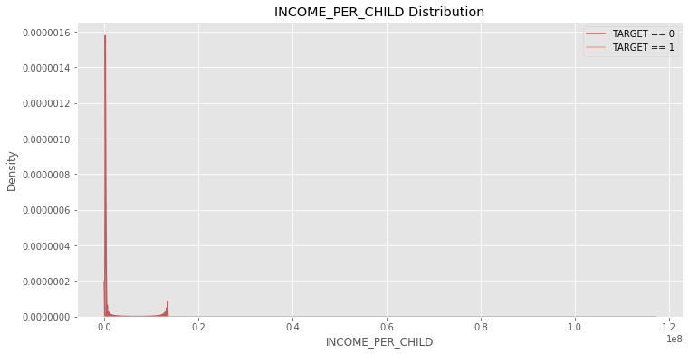


    The correlation between INCOME_PER_CHILD and the TARGET is -0.0045
    Median value for loan that was not repaid = 135000.0000
    Median value for loan that was repaid =     135000.0000


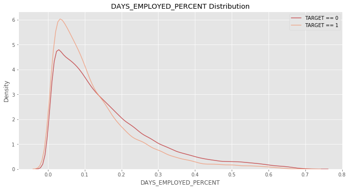


    The correlation between DAYS_EMPLOYED_PERCENT and the TARGET is -0.0680
    Median value for loan that was not repaid = 0.0935
    Median value for loan that was repaid =     0.1216


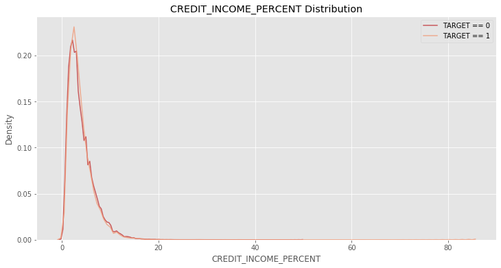


    The correlation between CREDIT_INCOME_PERCENT and the TARGET is -0.0077
    Median value for loan that was not repaid = 3.2531
    Median value for loan that was repaid =     3.2667


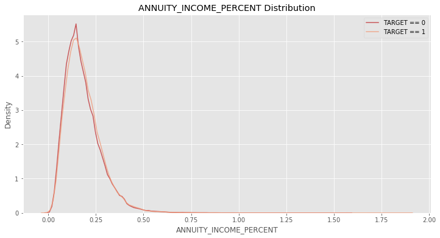


    The correlation between ANNUITY_INCOME_PERCENT and the TARGET is 0.0143
    Median value for loan that was not repaid = 0.1693
    Median value for loan that was repaid =     0.1623


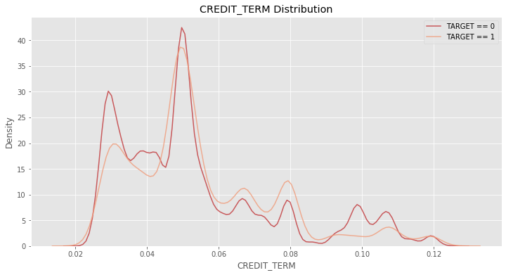


    The correlation between CREDIT_TERM and the TARGET is 0.0127
    Median value for loan that was not repaid = 0.0500
    Median value for loan that was repaid =     0.0500


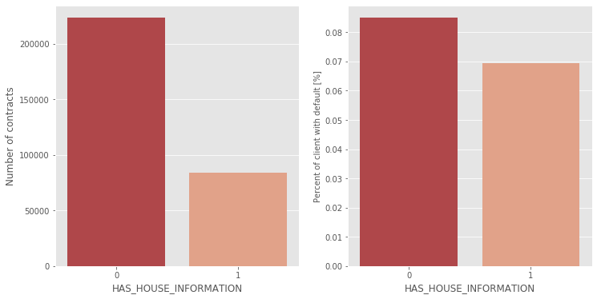


    Number of contracts
       HAS_HOUSE_INFORMATION  Number of contracts
    0                      0               223556
    1                      1                83955
    
    
    Percent of client with default [%]
       HAS_HOUSE_INFORMATION    TARGET
    0                      0  0.084981
    1                      1  0.069406
    
    


从上面的切片情况来看，大部分变量在违约用户和非违约用户中的分布并不明显。但是其重要性要在模型中，才能确定其效果。


```python
# Create new variable in test dataset
app_test['INCOME_PER_CHILD'] = app_test.apply(lambda x:Income_per_Child(x), axis=1)

app_test['DAYS_EMPLOYED_PERCENT'] = app_test['DAYS_EMPLOYED'] / app_test['DAYS_BIRTH']

app_test['CREDIT_INCOME_PERCENT'] = app_test['AMT_CREDIT'] / app_test['AMT_INCOME_TOTAL']

app_test['ANNUITY_INCOME_PERCENT'] = app_test['AMT_ANNUITY'] / app_test['AMT_INCOME_TOTAL']

app_test['CREDIT_TERM'] = app_test['AMT_ANNUITY'] / app_test['AMT_CREDIT']

app_test['HAS_HOUSE_INFORMATION'] = app_test['COMMONAREA_MEDI'].apply(lambda x:1 if x>0 else 0)
```

# 5.模型构建
这次模型的选择是 LightGBM 模型，这是 GBDM 的一个进化版本。拥有和 XBoost 一样的能自动处理缺少值的能力。同时具有高效并行的特点。在拟合 LightGBM 模型前，要对种类数据进行转码，在这次模型中，我们设置了两种转码方式，分别为 One Hot Encoding 和 Label Encoding。同时模型使用 k-fold 和 AUC 验证模型的准确性。


```python
""" Create the predictive model """

#import necessary module
from sklearn.model_selection import KFold
from sklearn.metrics import roc_auc_score
from lightgbm import LGBMClassifier
import gc
from sklearn.preprocessing import LabelEncoder
```


```python
# Create the model
def model(train_dataset, test_dataset, encoding = 'ohe', n_folds = 5):
    
    # Copy dataset
    train_dat = train_dataset.copy()
    test_dat = test_dataset.copy()
    
    #Extract the ids
    train_ids = train_dat['SK_ID_CURR']
    test_ids = test_dat['SK_ID_CURR']
    
    # Extract the labels for training
    labels = train_dat['TARGET']
    
    # Remove the target column
    train_dat = train_dat.drop(columns = ['SK_ID_CURR', 'TARGET'])
    test_dat = test_dat.drop(columns = ['SK_ID_CURR'])
    
    
    # One Hot Encoding
    if encoding == 'ohe':
        train_dat = pd.get_dummies(train_dat)
        test_dat = pd.get_dummies(test_dat)
        
        # Align the dataframes by the columns
        train_dat, test_dat = train_dat.align(test_dat, join = 'inner', axis = 1)
        
        # No categorical indices to record
        cat_indices = 'auto'
    
    # Integer label encoding
    elif encoding == 'le':
        
        # Create a label encoder
        label_encoder = LabelEncoder()
        
        # List for storing categorical indices
        cat_indices = []
        
        # Iterate through each column
        for i, col in enumerate(train_dat):
            if train_dat[col].dtype == 'object':
                # Map the categorical features to integers
                train_dat[col] = label_encoder.fit_transform(np.array(train_dat[col].astype(str)).reshape((-1,)))
                test_dat[col] = label_encoder.transform(np.array(test_dat[col].astype(str)).reshape((-1,)))

                # Record the categorical indices
                cat_indices.append(i)
    
    # Catch error if label encoding scheme is not valid
    else:
        raise ValueError("Encoding must be either 'ohe' or 'le'")
        
    print('Training Data Shape: ', train_dat.shape)
    print('Testing Data Shape: ', test_dat.shape)
    
    # Extract feature names
    feature_names = list(train_dat.columns)
    
    # Convert to np arrays
    train_dat = np.array(train_dat)
    test_dat = np.array(test_dat)
    
    # Create the kfold object
    k_fold = KFold(n_splits = n_folds, shuffle = True, random_state = 50)
    
    # Empty array for feature importances
    feature_importance_values = np.zeros(len(feature_names))
    
    # Empty array for test predictions
    test_predictions = np.zeros(test_dat.shape[0])
    
    # Empty array for out of fold validation predictions
    out_of_fold = np.zeros(train_dat.shape[0])
    
    # Lists for recording validation and training scores
    valid_scores = []
    train_scores = []
    
    # Iterate through each fold
    for train_indices, valid_indices in k_fold.split(train_dat):
        
        # Training data for the fold
        train_features, train_labels = train_dat[train_indices], labels[train_indices]
        # Validation data for the fold
        valid_features, valid_labels = train_dat[valid_indices], labels[valid_indices]
        
        # Create the model
        model = LGBMClassifier(n_estimators=1000, objective = 'binary', 
                                   class_weight = 'balanced', learning_rate = 0.05, 
                                   reg_alpha = 0.1, reg_lambda = 0.1, 
                                   subsample = 0.8, n_jobs = -1, random_state = 50)
        
        # Train the model
        model.fit(train_features, train_labels, eval_metric = 'auc',
                  eval_set = [(valid_features, valid_labels), (train_features, train_labels)],
                  eval_names = ['valid', 'train'], categorical_feature = cat_indices,
                  early_stopping_rounds = 100, verbose = 200)
        
        # Record the best iteration
        best_iteration = model.best_iteration_
        
        # Record the feature importances
        feature_importance_values += model.feature_importances_ / k_fold.n_splits
        
        # Make predictions
        test_predictions += model.predict_proba(test_dat, num_iteration = best_iteration)[:, 1] / k_fold.n_splits
        
        # Record the out of fold predictions
        out_of_fold[valid_indices] = model.predict_proba(valid_features, num_iteration = best_iteration)[:, 1]
        
        # Record the best score
        valid_score = model.best_score_['valid']['auc']
        train_score = model.best_score_['train']['auc']
        
        valid_scores.append(valid_score)
        train_scores.append(train_score)
        
        # Clean up memory
        gc.enable()
        del model, train_features, valid_features
        gc.collect()
        
    # Make the submission dataframe
    submission = pd.DataFrame({'SK_ID_CURR': test_ids, 'TARGET': test_predictions})
    
    # Make the feature importance dataframe
    feature_importances = pd.DataFrame({'feature': feature_names, 'importance': feature_importance_values})
    
    # Overall validation score
    valid_auc = roc_auc_score(labels, out_of_fold)
    
    # Add the overall scores to the metrics
    valid_scores.append(valid_auc)
    train_scores.append(np.mean(train_scores))
    
    # Needed for creating dataframe of validation scores
    fold_names = list(range(n_folds))
    fold_names.append('overall')
    
    # Dataframe of validation scores
    metrics = pd.DataFrame({'fold': fold_names,
                            'train': train_scores,
                            'valid': valid_scores}) 
    
    return submission, feature_importances, metrics
```


```python
# Create the baseline model
seed = 8
base_submission, base_fi, base_metrics = model(app_train, app_test, encoding = 'le')
print('Baseline metrics')
print(base_metrics)
gc.collect
```

    Training Data Shape:  (307511, 126)
    Testing Data Shape:  (48744, 126)


    /Users/beenlack/opt/anaconda3/lib/python3.7/site-packages/lightgbm/basic.py:1295: UserWarning: categorical_feature in Dataset is overridden.
    New categorical_feature is [0, 1, 2, 3, 9, 10, 11, 12, 13, 26, 30, 38, 84, 85, 87, 88]
      'New categorical_feature is {}'.format(sorted(list(categorical_feature))))


    Training until validation scores don't improve for 100 rounds
    [200]	train's auc: 0.813041	train's binary_logloss: 0.533758	valid's auc: 0.761196	valid's binary_logloss: 0.552507
    Early stopping, best iteration is:
    [236]	train's auc: 0.819494	train's binary_logloss: 0.527008	valid's auc: 0.761634	valid's binary_logloss: 0.548466


    /Users/beenlack/opt/anaconda3/lib/python3.7/site-packages/lightgbm/basic.py:1295: UserWarning: categorical_feature in Dataset is overridden.
    New categorical_feature is [0, 1, 2, 3, 9, 10, 11, 12, 13, 26, 30, 38, 84, 85, 87, 88]
      'New categorical_feature is {}'.format(sorted(list(categorical_feature))))


    Training until validation scores don't improve for 100 rounds
    [200]	train's auc: 0.812112	train's binary_logloss: 0.534839	valid's auc: 0.765275	valid's binary_logloss: 0.552931
    Early stopping, best iteration is:
    [248]	train's auc: 0.821152	train's binary_logloss: 0.525445	valid's auc: 0.765431	valid's binary_logloss: 0.547321


    /Users/beenlack/opt/anaconda3/lib/python3.7/site-packages/lightgbm/basic.py:1295: UserWarning: categorical_feature in Dataset is overridden.
    New categorical_feature is [0, 1, 2, 3, 9, 10, 11, 12, 13, 26, 30, 38, 84, 85, 87, 88]
      'New categorical_feature is {}'.format(sorted(list(categorical_feature))))


    Training until validation scores don't improve for 100 rounds
    [200]	train's auc: 0.812292	train's binary_logloss: 0.535272	valid's auc: 0.769078	valid's binary_logloss: 0.553308
    Early stopping, best iteration is:
    [242]	train's auc: 0.820531	train's binary_logloss: 0.526907	valid's auc: 0.769466	valid's binary_logloss: 0.548043


    /Users/beenlack/opt/anaconda3/lib/python3.7/site-packages/lightgbm/basic.py:1295: UserWarning: categorical_feature in Dataset is overridden.
    New categorical_feature is [0, 1, 2, 3, 9, 10, 11, 12, 13, 26, 30, 38, 84, 85, 87, 88]
      'New categorical_feature is {}'.format(sorted(list(categorical_feature))))


    Training until validation scores don't improve for 100 rounds
    [200]	train's auc: 0.812675	train's binary_logloss: 0.534407	valid's auc: 0.763552	valid's binary_logloss: 0.552099
    Early stopping, best iteration is:
    [235]	train's auc: 0.819302	train's binary_logloss: 0.527625	valid's auc: 0.764077	valid's binary_logloss: 0.54783


    /Users/beenlack/opt/anaconda3/lib/python3.7/site-packages/lightgbm/basic.py:1295: UserWarning: categorical_feature in Dataset is overridden.
    New categorical_feature is [0, 1, 2, 3, 9, 10, 11, 12, 13, 26, 30, 38, 84, 85, 87, 88]
      'New categorical_feature is {}'.format(sorted(list(categorical_feature))))


    Training until validation scores don't improve for 100 rounds
    [200]	train's auc: 0.812717	train's binary_logloss: 0.53436	valid's auc: 0.763379	valid's binary_logloss: 0.554935
    [400]	train's auc: 0.845285	train's binary_logloss: 0.500396	valid's auc: 0.763443	valid's binary_logloss: 0.534614
    Early stopping, best iteration is:
    [357]	train's auc: 0.839246	train's binary_logloss: 0.506771	valid's auc: 0.763768	valid's binary_logloss: 0.538476
    Baseline metrics
          fold     train     valid
    0        0  0.819494  0.761634
    1        1  0.821152  0.765431
    2        2  0.820531  0.769466
    3        3  0.819302  0.764077
    4        4  0.839246  0.763768
    5  overall  0.823945  0.764815


    <function gc.collect(generation=2)>


从上面的表中得知，在 5 fold 的计算下，训练组的平均 AUC 为0.82，而验证组的平均 AUC 约为0.76。然后通过LightGBM自带的函数查看特征的重要性。


```python
#%%
# Explore the feature importances
def feature_importances_fig(df, num=15):
    
    # Sort features according to importance
    df = df.sort_values('importance', ascending = False).reset_index()
    
    # Normalize the feature importances to add up to one
    df['importance_normalized'] = df['importance'] / df['importance'].sum()

    # Make a horizontal bar chart of feature importances
    plt.figure(figsize = (10, 6))
    ax = plt.subplot()
    
    # Need to reverse the index to plot most important on top
    ax.barh(list(reversed(list(df.index[:num]))), 
            df['importance_normalized'].head(num), 
            align = 'center', edgecolor = 'k')
    
    # Set the yticks and labels
    ax.set_yticks(list(reversed(list(df.index[:num]))))
    ax.set_yticklabels(df['feature'].head(num))
    
    # Plot labeling
    plt.xlabel('Normalized Importance'); plt.title('Feature Importances')
    plt.show()
    
    return df

base_fi_sorted = feature_importances_fig(base_fi)
```


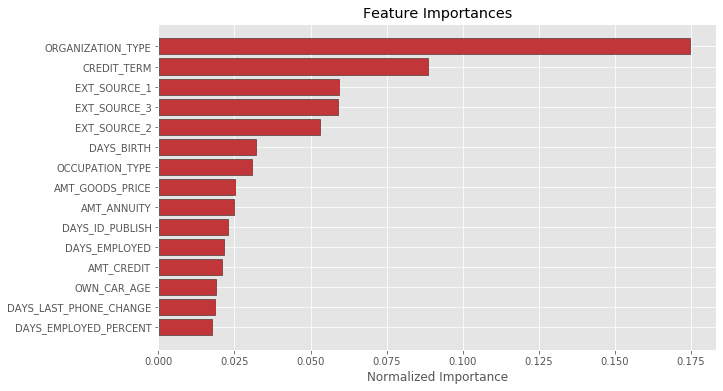


从上图可以看出，预测模型中，判断申请者是否违约的主要特征为申请者的职业（`'OGRGANIZATION_TYPE'`），紧接着的特征为申请者的贷款的还款周期（`'CREDIT_TERM'`）。

# 6. 模型改良
除了主训练集和预测集之外，我们还可以从辅助训练集获取申请者的信息，在这个项目中，我们将运用信用局记录和过往货款记录。

## 6.1. 清洗数据
在 2. 时，我们初步对数据集进行分析，得出主训练集和预测集里的客户，在信用局记录和过往货款记录中可能存在多条记录。现在根据`'SK_ID_CURR'`对这两个数据集进行检查。


```python
""" Improve model with extra dataset """

print('Bureau')
print(bureau_dat['SK_ID_CURR'].value_counts())
print('\n' 'Previous Application')
print(app_pre_dat['SK_ID_CURR'].value_counts())
```

    Bureau
    120860    116
    169704     94
    318065     78
    251643     61
    425396     60
             ... 
    206292      1
    216537      1
    106359      1
    100212      1
    250544      1
    Name: SK_ID_CURR, Length: 305811, dtype: int64
    
    Previous Application
    187868    77
    265681    73
    173680    72
    242412    68
    206783    67
              ..
    382489     1
    426056     1
    454726     1
    380442     1
    124145     1
    Name: SK_ID_CURR, Length: 338857, dtype: int64


从数据可得，信用局记录和过往货款记录中，分别有305811和338857名申请者信息，多名申请者存在多次货款记录。因为模型训练每个申请人在数据集中只能有一条记录，所以说我们不能直接把辅助训练集去和主训练集链接，一般来说需要去计算一些统计特征（groupby操作）。为了方便清洗，建立函数清洗数据集，
* 对于数值变量，计算其记录的次数和其数值的均值、最大值、最小值、总和；
* 而对于分类数据，先把分类变成哑变量，在计算其种类的次数和总体的比例。


```python
# Create aggregative function
def agg_dataset(df, id_var, df_name):
    
    # Remove id variables other than grouping variable
    for col in df:
        if col != id_var and 'SK_ID' in col:
            df = df.drop(columns = col)
    
    ## numeric variable
    group_ids = df[id_var]
    numeric_df = df.select_dtypes('number')
    numeric_df[id_var] = group_ids

    # Group by the specified variable and calculate the statistics
    agg = numeric_df.groupby(id_var).agg(['count', 'mean', 'max', 'min', 'sum'])

    # Need to create new column names
    columns = []

    # Iterate through the variables names
    for var in agg.columns.levels[0]:
        # Iterate through the stat names
        for stat in ['count', 'mean', 'max', 'min', 'sum']:
            # Make a new column name for the variable and stat
            columns.append('%s_%s_%s' % (df_name, var, stat))

    agg.columns = columns
    agg.sort_index()
    #agg.reset_index(inplace=True)    
    print(agg.shape)
    
    ## categorical
    # Select the categorical columns
    categorical = pd.get_dummies(df.select_dtypes('object'))

    # Make sure to put the identifying id on the column
    categorical[id_var] = df[id_var]

    # Groupby the group var and calculate the sum and mean
    categorical_grouped = categorical.groupby(id_var).agg(['sum', 'mean'])
    
    column_names = []
    
    # Iterate through the columns in level 0
    for var in categorical_grouped.columns.levels[0]:
        # Iterate through the stats in level 1
        for stat in ['count', 'count_norm']:
            # Make a new column name
            column_names.append('%s_%s_%s' % (df_name, var, stat))
    
    categorical_grouped.columns = column_names
    categorical_grouped.sort_index()
    #categorical_grouped.reset_index(inplace=True)
    print(categorical_grouped.shape)

    return pd.concat([agg, categorical_grouped], axis=1)
```

清洗信用局数据，得到305811条记录。


```python
# Aggregative Bureau_dat
bureau = agg_dataset(df=bureau_dat, id_var='SK_ID_CURR', df_name='bureau')
# Reset the index of Bureau_dat
bureau.reset_index(inplace=True)
bureau.head()
```

    /Users/beenlack/opt/anaconda3/lib/python3.7/site-packages/ipykernel_launcher.py:12: SettingWithCopyWarning: 
    A value is trying to be set on a copy of a slice from a DataFrame.
    Try using .loc[row_indexer,col_indexer] = value instead
    
    See the caveats in the documentation: https://pandas.pydata.org/pandas-docs/stable/user_guide/indexing.html#returning-a-view-versus-a-copy
      if sys.path[0] == '':


    (305811, 60)
    (305811, 46)


<div>
<style scoped>
    .dataframe tbody tr th:only-of-type {
        vertical-align: middle;
    }

    .dataframe tbody tr th {
        vertical-align: top;
    }

    .dataframe thead th {
        text-align: right;
    }
</style>
<table border="1" class="dataframe">
  <thead>
    <tr style="text-align: right;">
      <th></th>
      <th>SK_ID_CURR</th>
      <th>bureau_DAYS_CREDIT_count</th>
      <th>bureau_DAYS_CREDIT_mean</th>
      <th>bureau_DAYS_CREDIT_max</th>
      <th>bureau_DAYS_CREDIT_min</th>
      <th>bureau_DAYS_CREDIT_sum</th>
      <th>bureau_CREDIT_DAY_OVERDUE_count</th>
      <th>bureau_CREDIT_DAY_OVERDUE_mean</th>
      <th>bureau_CREDIT_DAY_OVERDUE_max</th>
      <th>bureau_CREDIT_DAY_OVERDUE_min</th>
      <th>...</th>
      <th>bureau_CREDIT_TYPE_Microloan_count</th>
      <th>bureau_CREDIT_TYPE_Microloan_count_norm</th>
      <th>bureau_CREDIT_TYPE_Mobile operator loan_count</th>
      <th>bureau_CREDIT_TYPE_Mobile operator loan_count_norm</th>
      <th>bureau_CREDIT_TYPE_Mortgage_count</th>
      <th>bureau_CREDIT_TYPE_Mortgage_count_norm</th>
      <th>bureau_CREDIT_TYPE_Real estate loan_count</th>
      <th>bureau_CREDIT_TYPE_Real estate loan_count_norm</th>
      <th>bureau_CREDIT_TYPE_Unknown type of loan_count</th>
      <th>bureau_CREDIT_TYPE_Unknown type of loan_count_norm</th>
    </tr>
  </thead>
  <tbody>
    <tr>
      <th>0</th>
      <td>100001</td>
      <td>7</td>
      <td>-735.000000</td>
      <td>-49</td>
      <td>-1572</td>
      <td>-5145</td>
      <td>7</td>
      <td>0.0</td>
      <td>0</td>
      <td>0</td>
      <td>...</td>
      <td>0</td>
      <td>0.0</td>
      <td>0</td>
      <td>0.0</td>
      <td>0</td>
      <td>0.0</td>
      <td>0</td>
      <td>0.0</td>
      <td>0</td>
      <td>0.0</td>
    </tr>
    <tr>
      <th>1</th>
      <td>100002</td>
      <td>8</td>
      <td>-874.000000</td>
      <td>-103</td>
      <td>-1437</td>
      <td>-6992</td>
      <td>8</td>
      <td>0.0</td>
      <td>0</td>
      <td>0</td>
      <td>...</td>
      <td>0</td>
      <td>0.0</td>
      <td>0</td>
      <td>0.0</td>
      <td>0</td>
      <td>0.0</td>
      <td>0</td>
      <td>0.0</td>
      <td>0</td>
      <td>0.0</td>
    </tr>
    <tr>
      <th>2</th>
      <td>100003</td>
      <td>4</td>
      <td>-1400.750000</td>
      <td>-606</td>
      <td>-2586</td>
      <td>-5603</td>
      <td>4</td>
      <td>0.0</td>
      <td>0</td>
      <td>0</td>
      <td>...</td>
      <td>0</td>
      <td>0.0</td>
      <td>0</td>
      <td>0.0</td>
      <td>0</td>
      <td>0.0</td>
      <td>0</td>
      <td>0.0</td>
      <td>0</td>
      <td>0.0</td>
    </tr>
    <tr>
      <th>3</th>
      <td>100004</td>
      <td>2</td>
      <td>-867.000000</td>
      <td>-408</td>
      <td>-1326</td>
      <td>-1734</td>
      <td>2</td>
      <td>0.0</td>
      <td>0</td>
      <td>0</td>
      <td>...</td>
      <td>0</td>
      <td>0.0</td>
      <td>0</td>
      <td>0.0</td>
      <td>0</td>
      <td>0.0</td>
      <td>0</td>
      <td>0.0</td>
      <td>0</td>
      <td>0.0</td>
    </tr>
    <tr>
      <th>4</th>
      <td>100005</td>
      <td>3</td>
      <td>-190.666667</td>
      <td>-62</td>
      <td>-373</td>
      <td>-572</td>
      <td>3</td>
      <td>0.0</td>
      <td>0</td>
      <td>0</td>
      <td>...</td>
      <td>0</td>
      <td>0.0</td>
      <td>0</td>
      <td>0.0</td>
      <td>0</td>
      <td>0.0</td>
      <td>0</td>
      <td>0.0</td>
      <td>0</td>
      <td>0.0</td>
    </tr>
  </tbody>
</table>
<p>5 rows × 107 columns</p>
</div>


清洗过往货款记录，得到338857条客户记录。


```python
# Aggregative app_pre_dat
app_pre = agg_dataset(df=app_pre_dat, id_var='SK_ID_CURR', df_name='app_pre')
# Reset the index of app_pre_dat
app_pre.reset_index(inplace=True)
app_pre.head()
```

    /Users/beenlack/opt/anaconda3/lib/python3.7/site-packages/ipykernel_launcher.py:12: SettingWithCopyWarning: 
    A value is trying to be set on a copy of a slice from a DataFrame.
    Try using .loc[row_indexer,col_indexer] = value instead
    
    See the caveats in the documentation: https://pandas.pydata.org/pandas-docs/stable/user_guide/indexing.html#returning-a-view-versus-a-copy
      if sys.path[0] == '':


    (338857, 95)
    (338857, 286)


<div>
<style scoped>
    .dataframe tbody tr th:only-of-type {
        vertical-align: middle;
    }

    .dataframe tbody tr th {
        vertical-align: top;
    }

    .dataframe thead th {
        text-align: right;
    }
</style>
<table border="1" class="dataframe">
  <thead>
    <tr style="text-align: right;">
      <th></th>
      <th>SK_ID_CURR</th>
      <th>app_pre_AMT_ANNUITY_count</th>
      <th>app_pre_AMT_ANNUITY_mean</th>
      <th>app_pre_AMT_ANNUITY_max</th>
      <th>app_pre_AMT_ANNUITY_min</th>
      <th>app_pre_AMT_ANNUITY_sum</th>
      <th>app_pre_AMT_APPLICATION_count</th>
      <th>app_pre_AMT_APPLICATION_mean</th>
      <th>app_pre_AMT_APPLICATION_max</th>
      <th>app_pre_AMT_APPLICATION_min</th>
      <th>...</th>
      <th>app_pre_PRODUCT_COMBINATION_POS industry without interest_count</th>
      <th>app_pre_PRODUCT_COMBINATION_POS industry without interest_count_norm</th>
      <th>app_pre_PRODUCT_COMBINATION_POS mobile with interest_count</th>
      <th>app_pre_PRODUCT_COMBINATION_POS mobile with interest_count_norm</th>
      <th>app_pre_PRODUCT_COMBINATION_POS mobile without interest_count</th>
      <th>app_pre_PRODUCT_COMBINATION_POS mobile without interest_count_norm</th>
      <th>app_pre_PRODUCT_COMBINATION_POS other with interest_count</th>
      <th>app_pre_PRODUCT_COMBINATION_POS other with interest_count_norm</th>
      <th>app_pre_PRODUCT_COMBINATION_POS others without interest_count</th>
      <th>app_pre_PRODUCT_COMBINATION_POS others without interest_count_norm</th>
    </tr>
  </thead>
  <tbody>
    <tr>
      <th>0</th>
      <td>100001</td>
      <td>1</td>
      <td>3951.000</td>
      <td>3951.000</td>
      <td>3951.000</td>
      <td>3951.000</td>
      <td>1</td>
      <td>24835.50</td>
      <td>24835.5</td>
      <td>24835.5</td>
      <td>...</td>
      <td>0</td>
      <td>0.0</td>
      <td>1</td>
      <td>1.0</td>
      <td>0</td>
      <td>0.0</td>
      <td>0</td>
      <td>0.0</td>
      <td>0</td>
      <td>0.0</td>
    </tr>
    <tr>
      <th>1</th>
      <td>100002</td>
      <td>1</td>
      <td>9251.775</td>
      <td>9251.775</td>
      <td>9251.775</td>
      <td>9251.775</td>
      <td>1</td>
      <td>179055.00</td>
      <td>179055.0</td>
      <td>179055.0</td>
      <td>...</td>
      <td>0</td>
      <td>0.0</td>
      <td>0</td>
      <td>0.0</td>
      <td>0</td>
      <td>0.0</td>
      <td>1</td>
      <td>1.0</td>
      <td>0</td>
      <td>0.0</td>
    </tr>
    <tr>
      <th>2</th>
      <td>100003</td>
      <td>3</td>
      <td>56553.990</td>
      <td>98356.995</td>
      <td>6737.310</td>
      <td>169661.970</td>
      <td>3</td>
      <td>435436.50</td>
      <td>900000.0</td>
      <td>68809.5</td>
      <td>...</td>
      <td>0</td>
      <td>0.0</td>
      <td>0</td>
      <td>0.0</td>
      <td>0</td>
      <td>0.0</td>
      <td>0</td>
      <td>0.0</td>
      <td>0</td>
      <td>0.0</td>
    </tr>
    <tr>
      <th>3</th>
      <td>100004</td>
      <td>1</td>
      <td>5357.250</td>
      <td>5357.250</td>
      <td>5357.250</td>
      <td>5357.250</td>
      <td>1</td>
      <td>24282.00</td>
      <td>24282.0</td>
      <td>24282.0</td>
      <td>...</td>
      <td>0</td>
      <td>0.0</td>
      <td>0</td>
      <td>0.0</td>
      <td>1</td>
      <td>1.0</td>
      <td>0</td>
      <td>0.0</td>
      <td>0</td>
      <td>0.0</td>
    </tr>
    <tr>
      <th>4</th>
      <td>100005</td>
      <td>1</td>
      <td>4813.200</td>
      <td>4813.200</td>
      <td>4813.200</td>
      <td>4813.200</td>
      <td>2</td>
      <td>22308.75</td>
      <td>44617.5</td>
      <td>0.0</td>
      <td>...</td>
      <td>0</td>
      <td>0.0</td>
      <td>1</td>
      <td>0.5</td>
      <td>0</td>
      <td>0.0</td>
      <td>0</td>
      <td>0.0</td>
      <td>0</td>
      <td>0.0</td>
    </tr>
  </tbody>
</table>
<p>5 rows × 382 columns</p>
</div>


清洗完后，把信用局记录和过往货款记录和主训练集链接。


```python
# Merget dataset
app_train_mix = app_train.merge(bureau, on = 'SK_ID_CURR', how = 'left')
app_train_mix = app_train_mix.merge(app_pre, on = 'SK_ID_CURR', how = 'left')
print(app_train_mix.shape)
```

    (307511, 615)


清洗完后，把信用局记录和过往货款记录和测试集链接。


```python
app_test_mix = app_test.merge(bureau, on = 'SK_ID_CURR', how = 'left')
app_test_mix = app_test_mix.merge(app_pre, on = 'SK_ID_CURR', how = 'left')
print(app_test_mix.shape)
```

    (48744, 614)


得到新的训练集和测试集，均有614个变量。查看用户违约情况和申请人在信用局开户的平均历史天数之间的关系。因为数据集中这个值是负数，推断出其含义是用户的开户时间越长，历史信用记录的时间越久越不容易违约。


```python
""" Explore the extra data """

explore_numeric(app_train_mix, 'bureau_DAYS_CREDIT_mean')
```


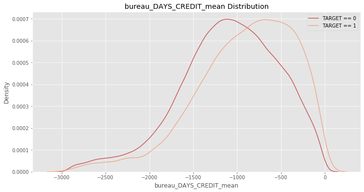


    The correlation between bureau_DAYS_CREDIT_mean and the TARGET is 0.0897
    Median value for loan that was not repaid = -835.3333
    Median value for loan that was repaid =     -1067.0000


## 6.2. 改良特征工程
在最后建模之前，我们还需要对这些加入的特征再做一次筛选，排除一些具有共线性的特征以提高模型的效果，我们可以计算变量与变量之间的相关系数，来快速移除一些相关性过高的变量。这里可以定义一个阈值（`threshold`）是0.8，即移除每一对相关性大于0.8的变量中的其中一个变量。


```python
""" Check collinearity """

app_train_mix.set_index('SK_ID_CURR', inplace=True)
labels = app_train_mix['TARGET']
train_dat_mix = app_train_mix.drop(columns = ['TARGET'])

# Correlation matrix
corrs = app_train_mix.corr()

# Set the threshold
threshold = 0.8

# Empty dictionary to hold correlated variables
above_threshold_vars = {}

# For each column, record the variables that are above the threshold
for col in corrs:
    above_threshold_vars[col] = list(corrs.index[corrs[col] > threshold])

# Track columns to remove and columns already examined
cols_to_remove = []
cols_seen = []
cols_to_remove_pair = []

# Iterate through columns and correlated columns
for key, value in above_threshold_vars.items():
    # Keep track of columns already examined
    cols_seen.append(key)
    for x in value:
        if x == key:
            next
        else:
            # Only want to remove one in a pair
            if x not in cols_seen:
                cols_to_remove.append(x)
                cols_to_remove_pair.append(key)
            
cols_to_remove = list(set(cols_to_remove))
print('Number of columns to remove: ', len(cols_to_remove))
```

    Number of columns to remove:  189


通过计算后得知，在新的训练集的614个变量中，有对189变量存在共线性，需要移除这些变量得到新的特征工程。更新后的训练集和测试集将有425个变量。


```python
# Removed the collinearity columns
train_corrs_removed = app_train_mix.drop(columns = cols_to_remove)
test_corrs_removed = app_test_mix.drop(columns = cols_to_remove)
train_corrs_removed['TARGET'] = labels
train_corrs_removed.reset_index(inplace=True)

print('Training Corrs Removed Shape: ', train_corrs_removed.shape)
print('Testing Corrs Removed Shape: ', test_corrs_removed.shape)
```

    Training Corrs Removed Shape:  (307511, 426)
    Testing Corrs Removed Shape:  (48744, 425)


## 6.3.模型改良
把新的训练集放到模型中计算。


```python
seed = 8
mix_submission, mix_fi, mix_metrics = model(train_corrs_removed, test_corrs_removed, encoding='le')
print('Mix model metrics')
print(mix_metrics)
gc.collect
```

    Training Data Shape:  (307511, 424)
    Testing Data Shape:  (48744, 424)


    /Users/beenlack/opt/anaconda3/lib/python3.7/site-packages/lightgbm/basic.py:1295: UserWarning: categorical_feature in Dataset is overridden.
    New categorical_feature is [0, 1, 2, 3, 8, 9, 10, 11, 12, 25, 27, 33, 48, 49, 50, 51]
      'New categorical_feature is {}'.format(sorted(list(categorical_feature))))


    Training until validation scores don't improve for 100 rounds
    [200]	train's auc: 0.829898	train's binary_logloss: 0.516521	valid's auc: 0.776361	valid's binary_logloss: 0.537154
    [400]	train's auc: 0.8667	train's binary_logloss: 0.47562	valid's auc: 0.777348	valid's binary_logloss: 0.510953
    Early stopping, best iteration is:
    [333]	train's auc: 0.855641	train's binary_logloss: 0.488105	valid's auc: 0.777699	valid's binary_logloss: 0.518979


    /Users/beenlack/opt/anaconda3/lib/python3.7/site-packages/lightgbm/basic.py:1295: UserWarning: categorical_feature in Dataset is overridden.
    New categorical_feature is [0, 1, 2, 3, 8, 9, 10, 11, 12, 25, 27, 33, 48, 49, 50, 51]
      'New categorical_feature is {}'.format(sorted(list(categorical_feature))))


    Training until validation scores don't improve for 100 rounds
    [200]	train's auc: 0.830421	train's binary_logloss: 0.516222	valid's auc: 0.77669	valid's binary_logloss: 0.536324
    [400]	train's auc: 0.867279	train's binary_logloss: 0.475014	valid's auc: 0.777226	valid's binary_logloss: 0.510267
    Early stopping, best iteration is:
    [331]	train's auc: 0.856024	train's binary_logloss: 0.487741	valid's auc: 0.777635	valid's binary_logloss: 0.518115


    /Users/beenlack/opt/anaconda3/lib/python3.7/site-packages/lightgbm/basic.py:1295: UserWarning: categorical_feature in Dataset is overridden.
    New categorical_feature is [0, 1, 2, 3, 8, 9, 10, 11, 12, 25, 27, 33, 48, 49, 50, 51]
      'New categorical_feature is {}'.format(sorted(list(categorical_feature))))


    Training until validation scores don't improve for 100 rounds
    [200]	train's auc: 0.829941	train's binary_logloss: 0.516975	valid's auc: 0.779683	valid's binary_logloss: 0.538676
    [400]	train's auc: 0.867022	train's binary_logloss: 0.47602	valid's auc: 0.781327	valid's binary_logloss: 0.512025
    Early stopping, best iteration is:
    [472]	train's auc: 0.878076	train's binary_logloss: 0.46328	valid's auc: 0.78172	valid's binary_logloss: 0.503824


    /Users/beenlack/opt/anaconda3/lib/python3.7/site-packages/lightgbm/basic.py:1295: UserWarning: categorical_feature in Dataset is overridden.
    New categorical_feature is [0, 1, 2, 3, 8, 9, 10, 11, 12, 25, 27, 33, 48, 49, 50, 51]
      'New categorical_feature is {}'.format(sorted(list(categorical_feature))))


    Training until validation scores don't improve for 100 rounds
    [200]	train's auc: 0.829832	train's binary_logloss: 0.516745	valid's auc: 0.776891	valid's binary_logloss: 0.537056
    [400]	train's auc: 0.866879	train's binary_logloss: 0.475769	valid's auc: 0.777353	valid's binary_logloss: 0.511674
    Early stopping, best iteration is:
    [314]	train's auc: 0.85252	train's binary_logloss: 0.491913	valid's auc: 0.777894	valid's binary_logloss: 0.521693


    /Users/beenlack/opt/anaconda3/lib/python3.7/site-packages/lightgbm/basic.py:1295: UserWarning: categorical_feature in Dataset is overridden.
    New categorical_feature is [0, 1, 2, 3, 8, 9, 10, 11, 12, 25, 27, 33, 48, 49, 50, 51]
      'New categorical_feature is {}'.format(sorted(list(categorical_feature))))


    Training until validation scores don't improve for 100 rounds
    [200]	train's auc: 0.830242	train's binary_logloss: 0.51648	valid's auc: 0.77345	valid's binary_logloss: 0.539156
    [400]	train's auc: 0.868033	train's binary_logloss: 0.474603	valid's auc: 0.774209	valid's binary_logloss: 0.513306
    Early stopping, best iteration is:
    [339]	train's auc: 0.857941	train's binary_logloss: 0.485915	valid's auc: 0.774414	valid's binary_logloss: 0.520233
    Mix model metrics
          fold     train     valid
    0        0  0.855641  0.777699
    1        1  0.856024  0.777635
    2        2  0.878076  0.781720
    3        3  0.852520  0.777894
    4        4  0.857941  0.774414
    5  overall  0.860040  0.777837


    <function gc.collect(generation=2)>


从上面的表中得知，训练集在新的特征工程下，训练组的平均 AUC 从0.82提升到0.86，而验证组的平均 AUC 从0.76提升到0.78。可见使用新的特征工程后，模型准确率得到提升。然后通过LightGBM自带的函数查看特征的重要性。


```python
mix_fi_sorted = feature_importances_fig(mix_fi, 30)
```


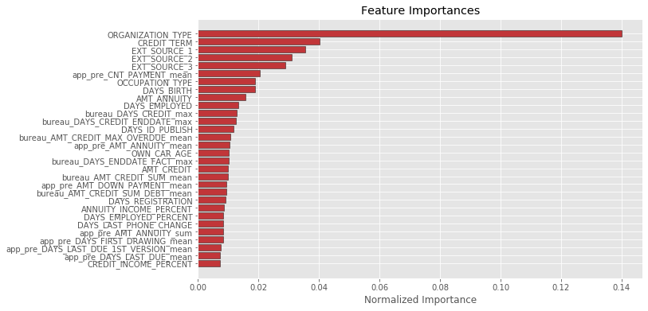


从上图可以看出，在新的预测模型中，判断申请者是否违约的主要特征仍然为申请者的职业（`'ORGANIZATION_TYPE'`）以及其还款周期（`'CREDIT_TERM'`）。在特征重要性排名的前十名中，出现了`'app_pre_CNT_PAYMENT_mean'`，这个特征来自过往货款记录，表示：“在过往货款记录的信息，货款的平均期限”。我们在这猜测其在业务上的介绍是，过往能货款期限越长，代表其信用约好，违约率将越小。可用前面建立的`explore_numeric`函数进行研究。得到预测结果如下。


```python
mix_submission.head()
```


<div>
<style scoped>
    .dataframe tbody tr th:only-of-type {
        vertical-align: middle;
    }

    .dataframe tbody tr th {
        vertical-align: top;
    }

    .dataframe thead th {
        text-align: right;
    }
</style>
<table border="1" class="dataframe">
  <thead>
    <tr style="text-align: right;">
      <th></th>
      <th>SK_ID_CURR</th>
      <th>TARGET</th>
    </tr>
  </thead>
  <tbody>
    <tr>
      <th>0</th>
      <td>100001</td>
      <td>0.252392</td>
    </tr>
    <tr>
      <th>1</th>
      <td>100005</td>
      <td>0.626357</td>
    </tr>
    <tr>
      <th>2</th>
      <td>100013</td>
      <td>0.143187</td>
    </tr>
    <tr>
      <th>3</th>
      <td>100028</td>
      <td>0.331297</td>
    </tr>
    <tr>
      <th>4</th>
      <td>100038</td>
      <td>0.720853</td>
    </tr>
  </tbody>
</table>
</div>


```python

```

